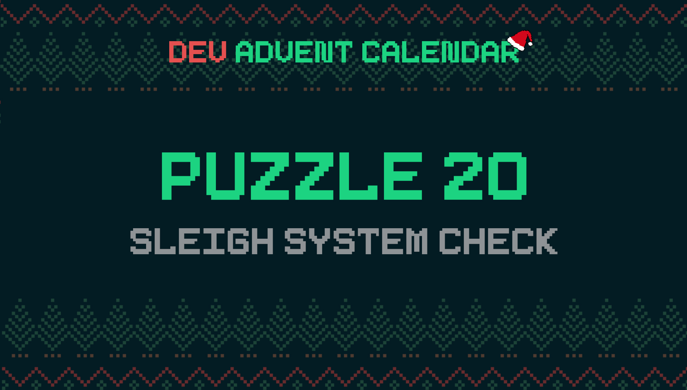

ℹ️ For detailed information about the contest, check out [devadvent/readme](https://github.com/devadvent/readme/)

# Dev Advent Calendar 🎅 Puzzle 20 - Sleigh Systems Check 🛷⚙️

The elves build and try out hundreds of sleighs for Santa, because they always improve it.
Before each test (and also take-off), the system needs to be checked.

Write a program that helps the head mechanic elf evaluate the test results.

## 🧩 The puzzle

Complete the function `checkSleigh` in [src/utils/check.js](src/utils/check.js) to generate the string that is used to evaluate the overall system capacity:

There are 10 subsystems that are being checked:

-   Accelerometer
-   Breaks
-   Compass
-   Gyroscope
-   Humidity Sensor
-   Langding Suspension
-   Navigation
-   Pressure Sensor
-   Temperature Sensor
-   WindSensor

The test results are available in an object such as this one:

```javascript
{
    serial: '07c1e0ae-d08b-4ae7-9eea-05e87b292535',
    version: '2021.893',
    compass: 0.9205,
    humiditySensor: 0.9853,
    accelerometer: 0.9983,
    navigation: 0.9673,
    langdingSuspension: 0.6486,
    breaks: 0.7564,
    pressureSensor: 0.9731,
    temperatureSensor: 0.9028,
    gyroscope: 0.9967,
    windSensor: 0.921,
}
```

Each value indicates the capacity (percentage expressed between `0` and `1`) at which each system operated during the test.
The elves that evaluate the tests are used to just a string of letters where each letter indicates a system that is running at good capacity.

So your job is it to create this value - For each system that works above or equal to 90%, add their letter to the string:

-   Accelerometer => `A`
-   Breaks => `B`
-   Compass => `C`
-   Gyroscope => `G`
-   Humidity Sensor => `H`
-   Langding Suspension => `L`
-   Navigation => `N`
-   Pressure Sensor => `P`
-   Temperature Sensor => `T`
-   WindSensor => `W`

Example for a fully working system: `ABCGHLNPTW`

### Rules

-   All letters must be in alphabetical order.
-   If a system works below 90%, it's not added to the string.
-   If **all** systems failed (below 90%), the string should be `X`.

## 🚢 Ship your solution

Check out the [contributing guide](https://github.com/devadvent/readme/blob/main/CONTRIBUTING.md) for details about how to participate.

In short:

-   ✨ Create your repository by [acceping the assignment](https://classroom.github.com/a/XXXXXXXXX) using the participation link
-   🧩 Solve the puzzle
-   🐦 Add your Twitter handle to `twitter.js`
-   🤖 Test your solution
-   🚀 Upload your changes to the `main` branch

## 🔗 Participation link

In order to participate, you need to enter the following link and accept the assignment:
[https://classroom.github.com/a/XXXXXXXXX](https://classroom.github.com/a/XXXXXXXXX)

## 💻 Use this project

### ⏳ Install the dependencies

Install the dependencies with

```bash
yarn install
```

or

```bash
npm install
```

### ⚙️ Run the code

Run the code with

```bash
yarn dev
```

or

```bash
npm run dev
```

ℹ️ In the [src/index.js](src/index.js) file, the autopilot is simulated with a 500ms delay. This way you can see live what your algorithm does.

ℹ️ There are 4 demo-maps to test out your code in [src/data](src/data). You can switch out the file name in the `index.js` file.

### 🤖 Test your solution

This puzzle is equipped with automated tests (in the `./tests` folder). In order for your solution to qualify for winning the daily prize, **all** tests need to pass.

To run these tests, execute one of the following commands in your console:

```bash
yarn test
```

or

```bash
npm test
```
